Last month, I had built an Automatic Speech Recognition (ASR) system for Hindi using the Kaldi Toolkit. This time, I have an ASR system for Punjabi. Instead of using Deep Neural Network (DNN) modeling like last time, I have tried to enforce a Subspace Gaussian Mixture Model. The entire code along with the speech data can be found on my GitHub page: https://github.com/OhmVikrant/ASR-for-Punjabi 

I shall not explain in detail as I did last time. For detailed information regarding the steps, please check out my previous blog on ASR for Hindi.If you already have enough knowledge regarding how ASR using Kaldi works, you can directly run the run.sh file after changing the path of the files..

## Data preprocessing

The data collected contains 80 sentences spoken by 4 different speakers; 2 male and 2 female. The speech contains only numbers spoken in Punjabi. So the word-level and phone-level lexicon files are created direcly without having to go through machine-coded transliteration. All the files are put together in both the train and test sets.

## Language Modeling

First the shell files are made executable with the command

>chmod +x (file_name)

A bigram language model (the n_gram is set to 2 here) is now created by executing the command

>./Create_ngram_LM.sh

The output is: 

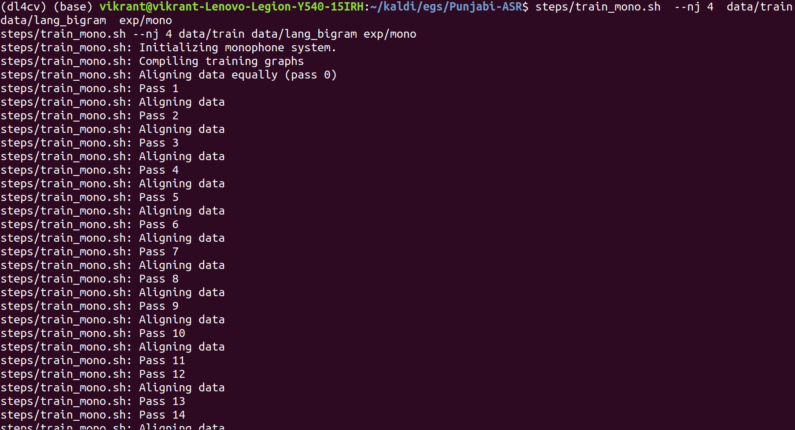

## Acoustic Modeling

### Monophone GMM-HMM training

Monophone means a context-independent phone. Monophone training is the first step before training with context-dependent phones.
First thing we should do is fix the folder structure of both train and test data:

> utils/fix_data_dir.sh data/train

> utils/fix_data_dir.sh data/test

After successful validation, we extract the MFCC features of the audio files:

> steps/make_mfcc.sh --nj 4 data/train exp/make_mfcc/train mfcc

> steps/make_mfcc.sh --nj 4 data/test exp/make_mfcc/test mfcc

Then we perform speaker normalization:

> steps/compute_cmvn_stats.sh data/train exp/make_mfcc/train mfcc

> steps/compute_cmvn_stats.sh data/test exp/make_mfcc/test mfcc

Again testing the validation of data directory (though not required, but it is a good practice):

> utils/validate_data_dir.sh data/train

> utils/validate_data_dir.sh data/test

Now comes the training part:

> steps/train_mono.sh --nj 4 data/train data/lang_bigram exp/mono

Now we need to form the graph of our model which would combine our language and acoustic models for best symbolization of the training. We execute:

> utils/mkgraph.sh --mono data/lang_bigram exp/mono exp/mono/graphD

Then we do decoding that is how our system performs with unseen test data:

> steps/decode.sh --nj 5 exp/mono/graph data/test exp/mono/decode

Now the output for our model:

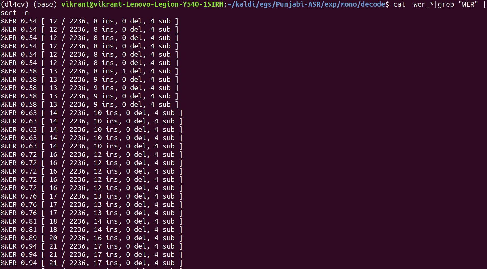

We get the least value of WER% as 0.54%.

### Triphone GMM-HMM training

A triphone is a sequence of three phonemes, hence a context-dependent phone. Triphones are useful in models of natural language processing where they are used to establish the various contexts in which a phoneme can occur in a particular language.

We align the monophone system to obtain the phone boundaries, while also boosting the silence for better performance in noisy environments. We run from the parent directory:

> steps/align_si.sh --boost-silence 1.25 --nj 5 data/train data/lang_bigram exp/mono exp/mono_alpha

Now we train the triphone model for differential coefficients:

> steps/train_deltas.sh 2500 25000 data/train data/lang_bigram exp/mono_alpha exp/tri

2500 is the value of the maximum number of senons we want to fit and 25000 is the maximum number of gaussians to be modelled.

Similar to monophone training, we run:

> utils/mkgraph.sh data/lang_bigram exp/tri exp/tri/graph

> steps/decode.sh --nj 5 exp/tri/graph data/test exp/tri/decode

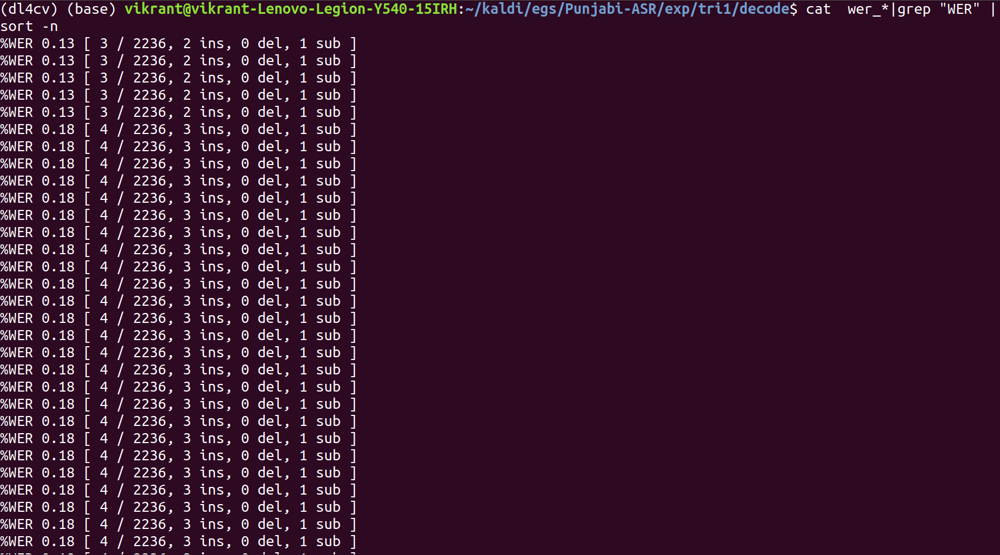

The least WER% comes out to be 0.13%.

Now we do Delta-Delta training to determine acceleration coeffficients. The steps are similar to the previous training:

> steps/align_si.sh --nj 4 data/train data/lang_bigram exp/tri1 exp/tri1_alpha
> steps/train_deltas.sh 2500 30000 data/train data/lang_bigram exp/tri1_alpha exp/tri2
> utils/mkgraph.sh data/lang_bigram exp/tri2 exp/tri2/graph
> steps/decode.sh --nj 4 exp/tri2/graph data/test exp/tri2/decode

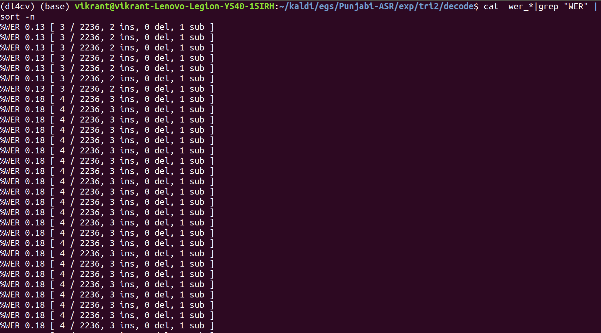

The least WER% comes out to be 0.13%.

### Speaker Adaption

First, we perform Linear Discriminant Analysis (LDA) for de-correlation and dimensionality reduction, and then
Maximum Likelihood Linear Transform (MLLT) for further precision:

> steps/align_si.sh --nj 4 data/train data/lang_bigram exp/tri2 exp/tri2_alpha
> steps/train_lda_mllt.sh 2000 16000 data/train data/lang_bigram exp/tri2_alpha exp/tri3
> utils/mkgraph.sh data/lang_bigram exp/tri3 exp/tri3/graph
> steps/decode.sh --nj 4 exp/tri3/graph data/test exp/tri3/decode

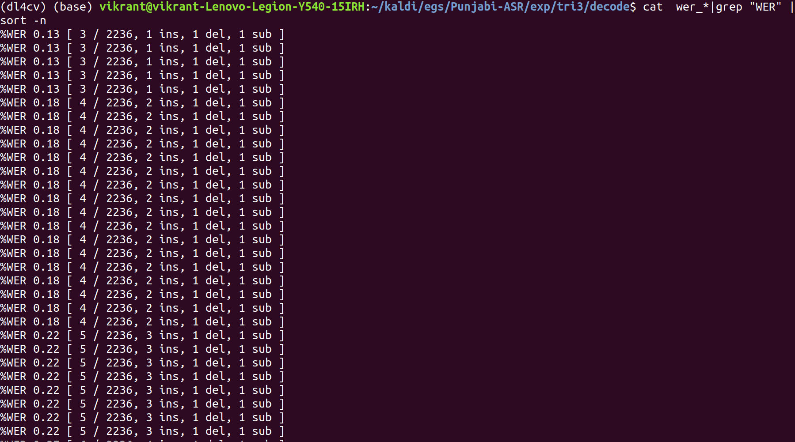

The least WER% remains the same: 0.13%.

After speaker dependent adaption, we perform speaker independent adaption using Feature space Maximum Likelihood Linear Regression (fMLLR) for normalization of inter-
speaker variability:

> steps/align_si.sh --nj 4 data/train data/lang_bigram exp/tri3 exp/tri3_alpha
> steps/train_sat.sh 2000 16000 data/train data/lang_bigram exp/tri3_alpha exp/tri4

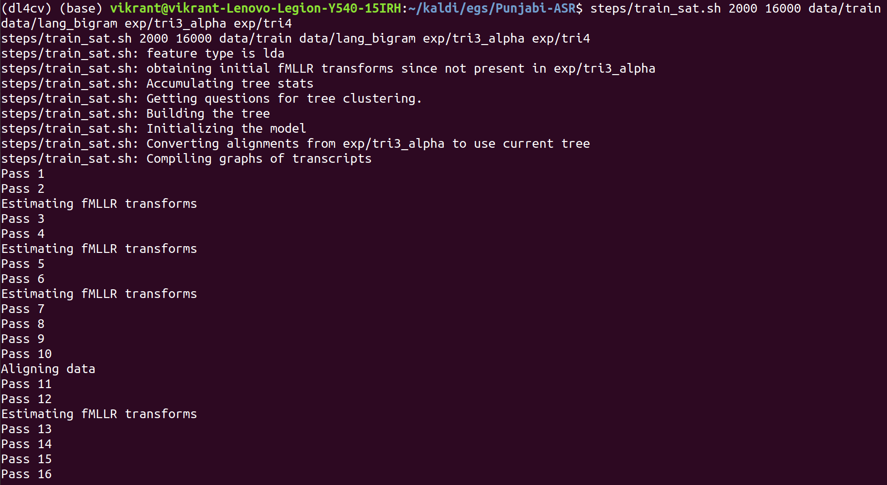

> utils/mkgraph.sh data/lang_bigram exp/tri4 exp/tri4/graph
> steps/decode_fmllr.sh --nj 4 exp/tri4/graph data/test exp/tri4/decode

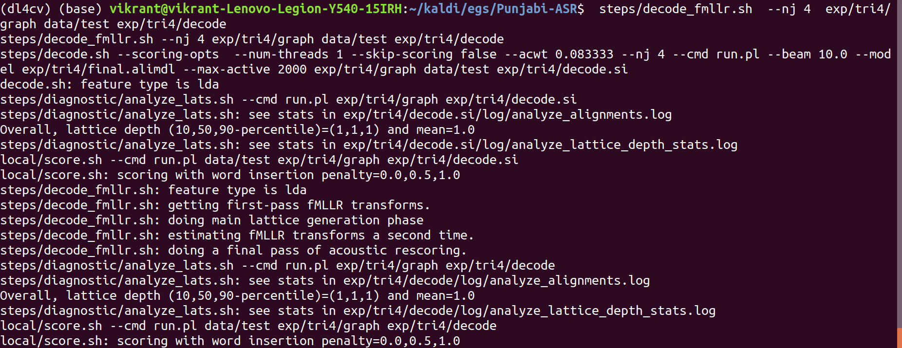

The final output is:

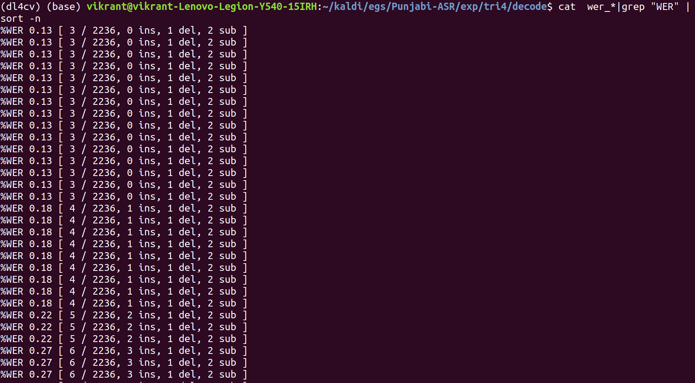

The WER is still the same : 0.13%

### SGMM-HMM training  

First we align the triphone model and the universal background model from the parent directory:

> steps/align_fmllr.sh --nj 4 data/train data/lang_bigram exp/tri4 exp/tri4_alpha
> steps/train_ubm.sh 700 data/train data/lang_bigram exp/tri4_alpha exp/ubm

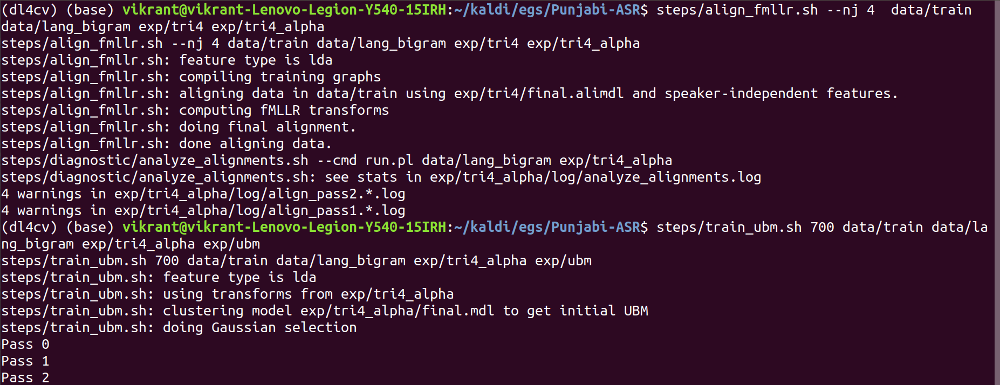

Then we train the SGMM state emission model:

> steps/train_sgmm2.sh 10000 7000 data/train data/lang_bigram exp/tri4_alpha exp/ubm/final.ubm exp/sgmm

The command seems to be complex but is actually very simple and self-explanatory.

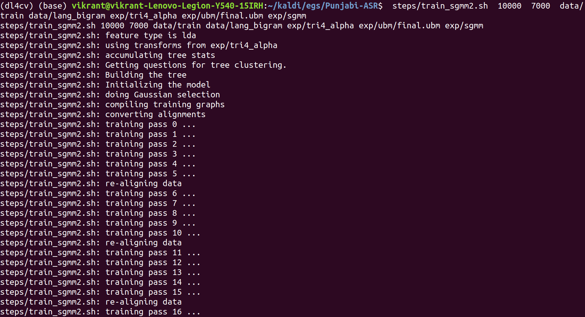

Then like the earlier models, we go through:

> utils/mkgraph.sh data/lang_bigram exp/sgmm exp/sgmm/graph
> steps/decode_sgmm2.sh --nj 4 exp/tri4_alpha/decode exp/sgmm/graph data/test exp/sgmm/decode

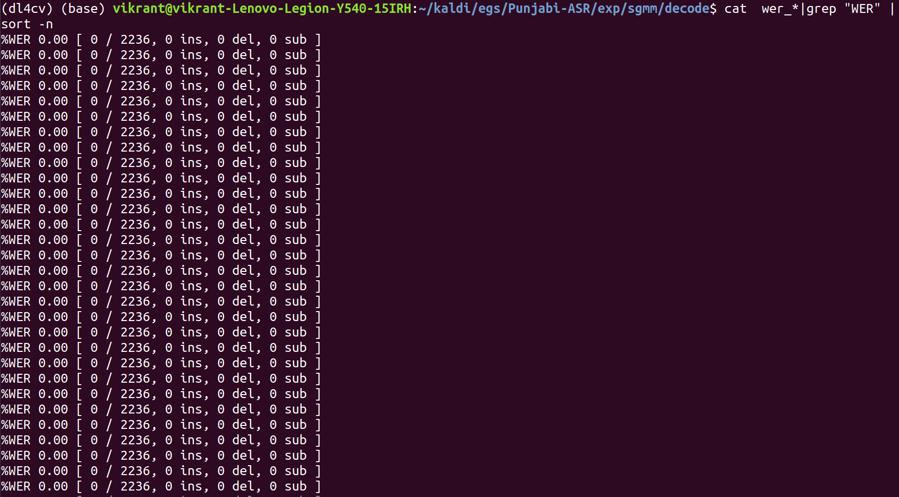

This is our best system with WER% of 0.00%. Clearly the model has ovefitted but this was intended for achieving a higher accuracy as the dataset is quite small. For a more generalized model, we can collect a larger dataset and train using Deep neural networks as done in my previous ASR project with Hindi. Do not forget to check that out.
